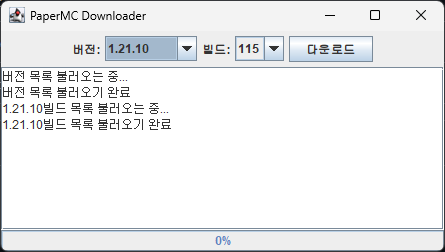
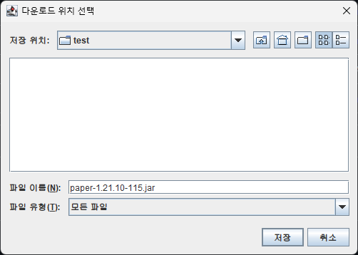
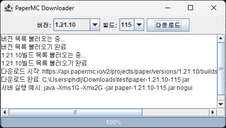
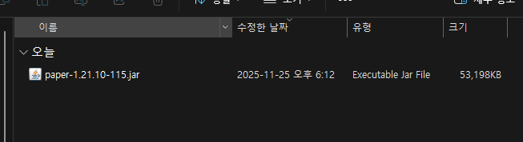

# PaperMC 다운로더
- 버전 목록, 빌드 목록을 통해 선택할 수 있습니다.

## 사용 환경
- JVM (Java 17 이상)

## 사용 방법
1. 프로젝트 파일을 실행합니다.
2. 원하는 버전과 빌드를 선택합니다.
- 
3. 다운로드 버튼을 클릭합니다.
4. 다운받은 파일을 저장할 경로를 선택합니다.
- 
5. 다운이 완료됩니다.
- 
- 

## 추가 내용
- rc 버전은 다운이 잘 안될 수도 있습니다.